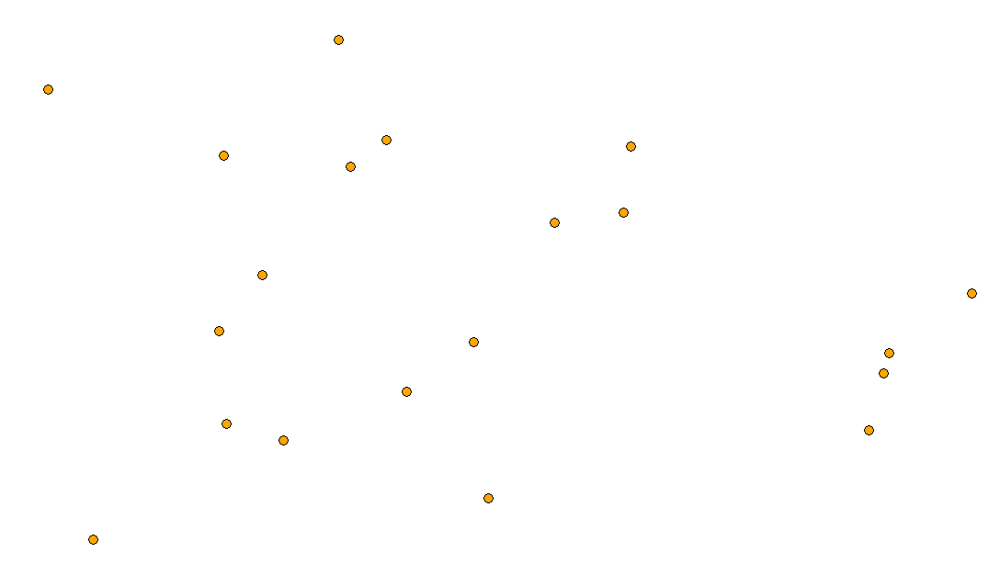
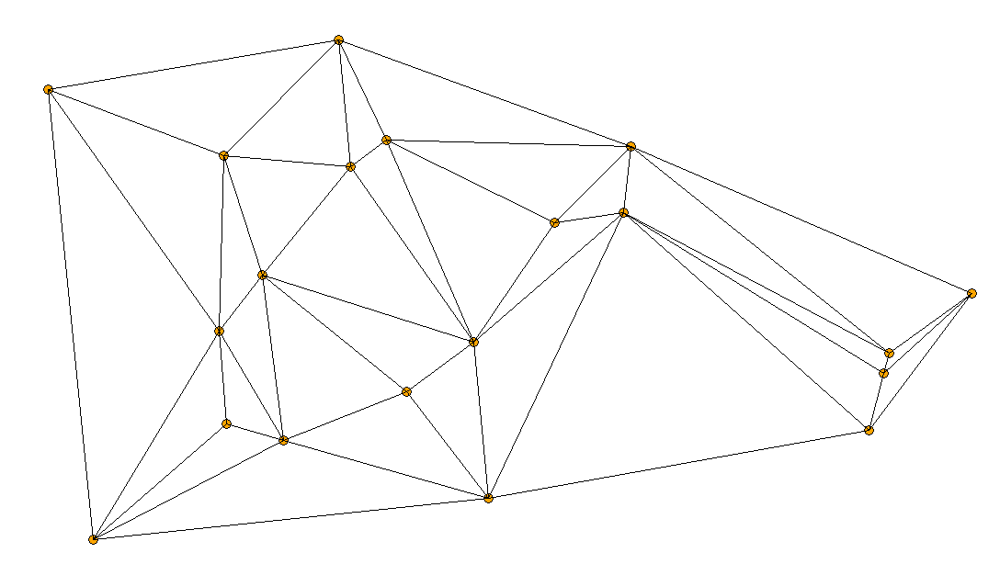

# Delaunay Mesh Creation Playground

## Introduction

Given a set of points on the plane, it is a common problem on how we could connect them to form a connected graph, or as other people call a connected 2D-mesh.
Obviously, a handcrafted solution is very time-consuming for a huge number of points. 
Delaunay Triangulation is an algorithm that automatically complete this task for us. 




## Prerequisite

Install packages with 
```
pip install -r requirements.txt
```

This program is developed in Windows 10 with Python 3.9

## How to use it

Run 
```
python app.py
```
. A window will pop up.
Press "Start" to begin.

Create some points by clicking on the white canvas. 
You can also use "Generate Points" to generate a bunch of random points quickly. 

Click "Create Mesh" to utilize Delaunay algorithm to visualize the mesh creation on the canvas. 

If you like the result, click "Export" to save the image inside the same working directory.